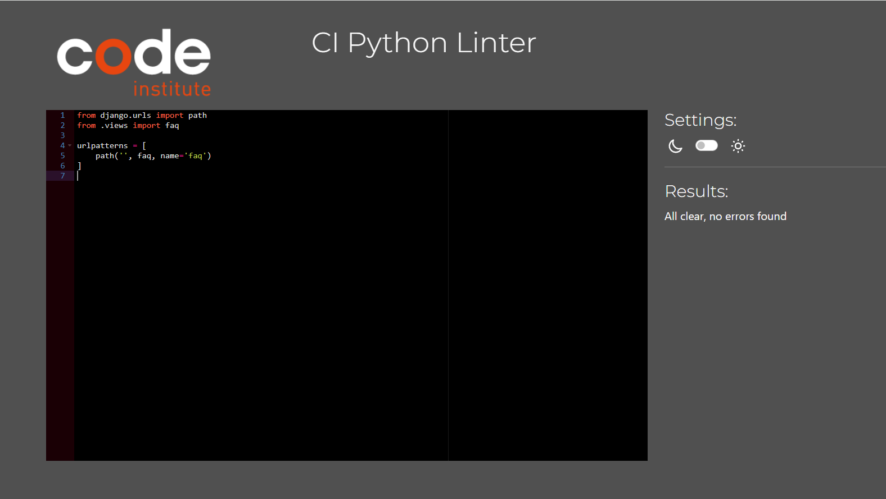
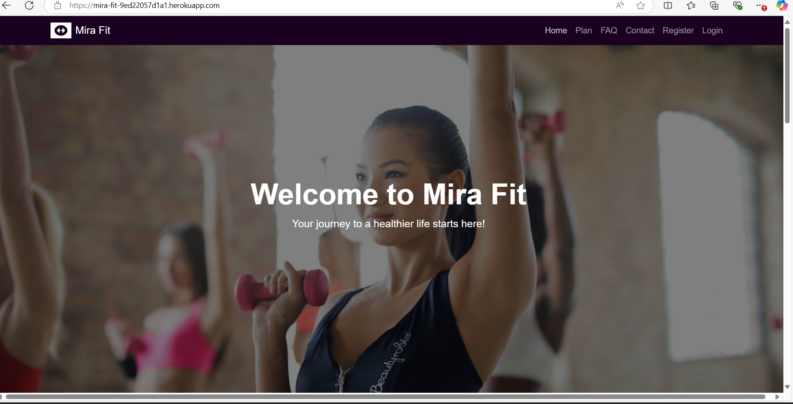
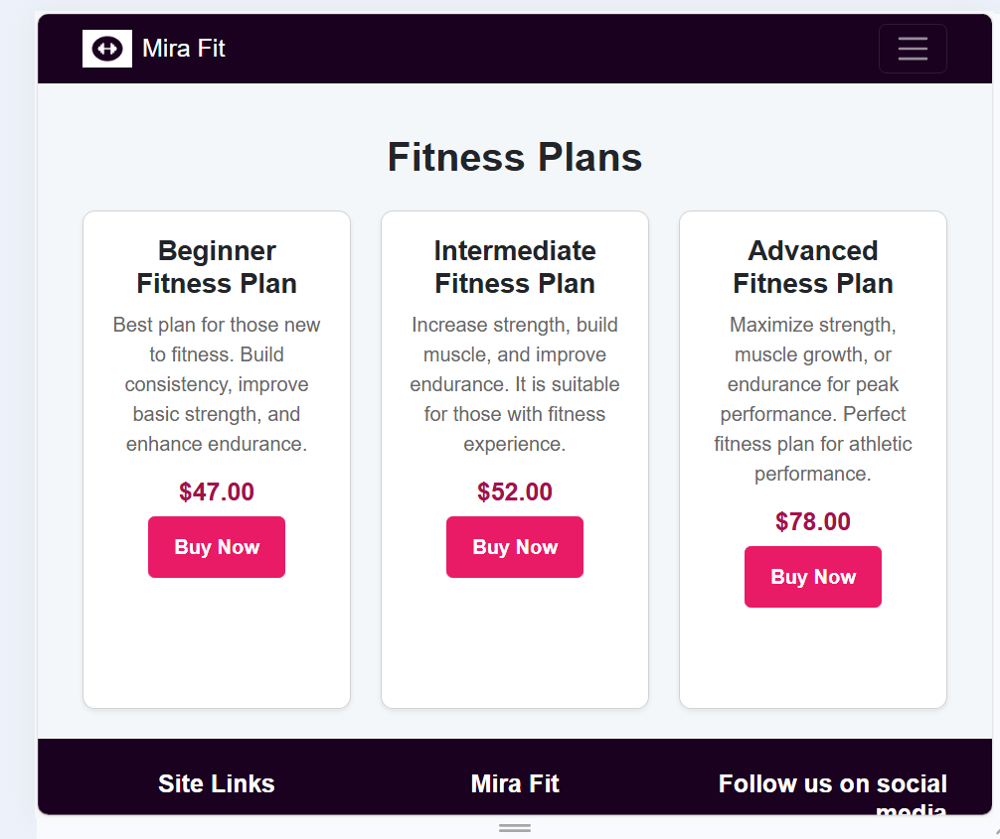
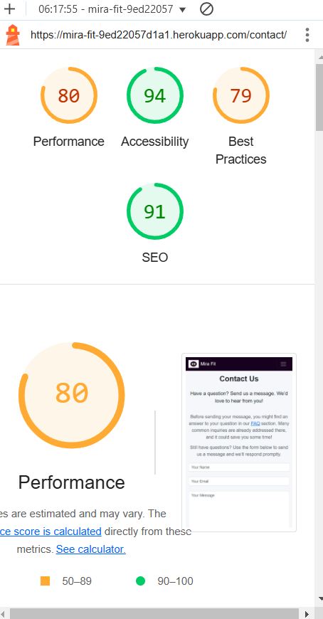
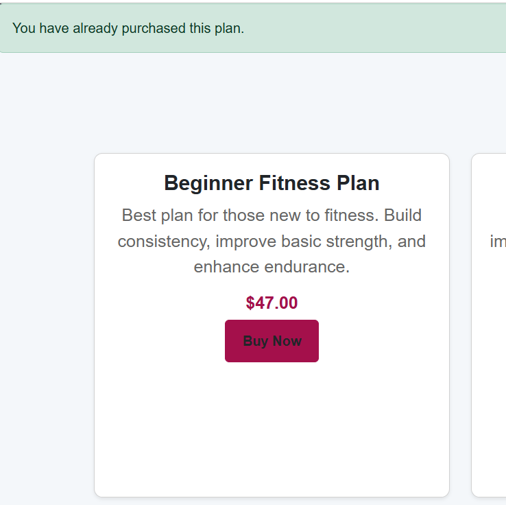
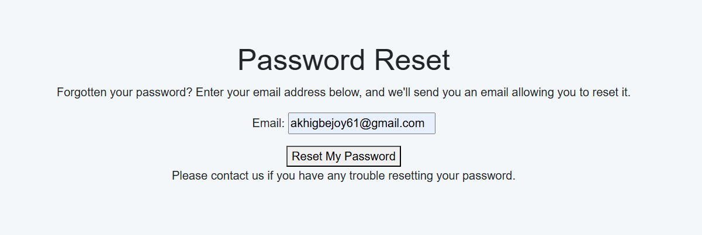

# Testing

> [!NOTE]  
> Return back to the [README.md](README.md) file.

## Code Validation

### HTML

I have used the recommended [HTML W3C Validator](https://validator.w3.org) to validate all of my HTML files.

| Directory | File | Screenshot | Notes |
| --- | --- | --- | --- |
| profiles | profiles.html |  | Pass: No Errors |
| accounts | signup.html |  | I am aware of this error from the validator and is happening due to allauth. I have attempted to remove it in the signup form however I was unable to fix it for that reason error will still show up in the validator. |
| checkout | checkout.html |  | Pass: No Errors |
| contact | contact_form.html |  | Pass: No Errors |
| faq | faq.html |  | Pass: No Errors |
| home | home.html |  | Pass: No Errors |
| plans | plans.html |  | Pass: No Errors |
|accounts | login.html |  | Pass: No Errors |
| home | review.html |  | Pass: No Errors |

### CSS

I have used the recommended [CSS Jigsaw Validator](https://jigsaw.w3.org/css-validator) to validate all of my CSS files.

| Directory | File | Screenshot | Notes |
| --- | --- | --- | --- |
| checkout | checkout.css |  | Pass: No Errors |
| profiles | profiles.css |  | Pass: No Errors |
| static | style.css |  | Pass: No Errors |

### JavaScript

I have used the recommended [JShint Validator](https://jshint.com) to validate all of my JS files.

| Directory | File | Screenshot | Notes |
| --- | --- | --- | --- |

| checkout/js | stripe_elements.js |  | Pass: No Errors |

### Python

I have used the recommended [PEP8 CI Python Linter](https://pep8ci.herokuapp.com) to validate all of my Python files.

| Directory | File | Screenshot | Notes |
| --- | --- | --- | --- |
| profiles | urls.py |  | Pass: No Errors |
| profiles | views.py |  | Pass: No Errors |
| profiles | admin.py |  | Pass: No Errors |
| profiles | signal.py |  | Pass: No Errors |
| profiles | models.py |  | Pass: No Errors |
| profiles | forms.py |   | Pass: No Errors |
| home | urls.py |  | Pass: No Errors |
| home | views.py |  | Pass: No Errors |
| home | admin.py |  | Pass: No Errors |
| home | context_processors.py |  | Pass: No Errors |
| home | models.py |  | Pass: No Errors |
| home | forms.py |   | Pass: No Errors |
| checkout | forms.py |  | Pass: No Errors |
| checkout | models.py |  | Pass: No Errors |
| checkout | forms.py |  | Pass: No Errors |
| checkout | models.py |  | Pass: No Errors |
| checkout | urls.py |  | Pass: No Errors |
| checkout | views.py |  | Pass: No Errors |
| checkout | admin.py |  | Pass: No Errors |
| contact | forms.py |  | Pass: No Errors |
| contact | models.py |  | Pass: No Errors |
| contact | urls.py |  | Pass: No Errors |
| contact | views.py |  | Pass: No Errors |
| contact | admin.py |  | Pass: No Errors |
|  | custom_storages.py |  | Pass: No Errors |
| faq | urls.py |  | Pass: No Errors |
| faq | views.py |  | Pass: No Errors |
| mira_fit | settings.py |  | Pass: No Errors |
| mira_fit | urls.py |  | Pass: No Errors |
| mira_fit | views.py |  | Pass: No Errors |
|  | manage.py |  | Pass: No Errors |
| plan | admin.py  |  | Pass: No Errors |
| plans | models.py |  | Pass: No Errors |
| plans | urls.py |  | Pass: No Errors |
| plans | views.py |  | Pass: No Errors |

## Browser Compatibility

I've tested my deployed project on multiple browsers to check for compatibility issues.

| Browser | Home | Plans | FAQ | Profile | Edit Profile | Logout | Login | Register | Checkout | Checkout Success | 404 Page | Notes |
| --- | --- | --- | --- | --- | --- | --- | --- | --- | --- | --- | --- | --- |
| Chrome |  |  |  |  |  |  |  |  |  |  |  | Works as expected |
| Edge |  |  |  |  |  |  |  |  |  |  |  | Works as expected |

## Responsiveness

I've tested my deployed project on multiple devices to check for responsiveness issues.

| Device | Home | Contact | Plans | FAQ | Profile | Edit Profile | Checkout | 404 Page | Notes |
| --- | --- | --- | --- | --- | --- | --- | --- | --- | --- |
| Mobile (DevTools) |  |  |  |  |  |  |  |  | Works as expected |
| Tablet (DevTools) |  |  |  |  |  |  |  |  | Works as expected |
| Desktop |  |  |  |  |  |  |  |  | Works as expected |

## Lighthouse Audit

I've tested my deployed project using the Lighthouse Audit tool to check for any major issues.

| Page | Mobile | Desktop | Notes |
| --- | --- | --- | --- |
| Home |  |  | some minor warnings |
| Contact |  |  | some minor warnings |
| Plans |  |  | Some minor warnings |
| FAQ |  |  | Some minor warnings |
| Profile |  |  | Some minor warnings |

## Defensive Programming

Defensive programming was manually tested with the below user acceptance testing:

| Page | Expectation | Test | Result | Fix | Screenshot |
| --- | --- | --- | --- | --- | --- |
| All Pages | | | | | |
| | The footer should contain quick links, social media icons, and  copyright. | Checked the footer section. | The footer displayed all expected elements: quick links, and social media icon. | Test concluded and passed |  |
| | Logo should be visible on the header. | Loaded the homepage. | The logo was displayed as expected in the header section. | Test concluded and passed. |  |
| | Newsletter subscription form should accept input and provide feedback | Entered an email address in the newsletter form. | The form accepted the input, and feedback was provided upon submission. | Test concluded and passed. |  |
| | Quick links should be visible and clickable in the footer. | Tested each quick link by clicking on it. | All quick links navigated to their respective pages correctly. | Test concluded and passed. |  |
| | Responsive navigation should adjust for smaller screens with a toggle menu. | Resized the browser window to a smaller width. | The navigation adjusted and displayed a toggle menu correctly. | Test concluded and passed. |  |
| | Responsive navigation should expand to show links when the menu is toggled. | Clicked on the menu toggle. | The navigation expanded and displayed all links as expected. | Test concluded and passed. |  |
| | Social media links should be visible and linked correctly in the footer. | Clicked on each social media icon. | Each icon correctly linked to the corresponding social media page. | Test concluded and passed. |  |
| | Navigation for unauthenticated users should show "Login" and "Register". | Logged out and viewed the home page. | The navigation correctly displayed "Login" and "Register" for unauthenticated users. | Test concluded and passed. |  |
| Home | | | | | |
| | The Home Page section should display a clear, motivational message with an appropriate background. | Checked the section on page load. | The page displayed correctly with text and image. | Test concluded and passed. |  |
| | The 'Client Reviews' section should showcase client feedback with images and ratings. | Viewed client reviews on the homepage. | Client reviews displayed correctly with text, and star ratings as expected. | Test concluded and passed. |  |
| Plans | | | | | |
| | If the user is unauthenticated and clicks "Purchase," they should be redirected to the login page. | Tested by clicking "Purchase" as an unauthenticated user. | The user was redirected to the login page as expected. | Test concluded and passed. |  |
| | If the user is authenticated and clicks "Purchase," they should be redirected to the checkout page. | Tested by clicking "Purchase" as an authenticated user. | The user was redirected to the checkout page correctly. | Test concluded and passed. |  | 
| | If the user has already purchased a specific plan, the user gets a message when the user click on the plan saying you have already perchased this plan. displayed correctly as expected. | Test concluded and passed. |  |
| FAQ | | | | | |
| | The "Frequently Asked Questions" section should display a list of questions with expandable accordion items for each category. The questions should expand to show the answers when clicked. | Clicked on different FAQ categories and questions to expand them. | The FAQ section displayed correctly, showing answers upon clicking. | Test concluded and passed. |  |
| Login | | | | | |
| | The login form should accept email and password inputs, have a "Remember Me" option, and provide links to "Forgot Password?" and "Sign up." | Tested the login form with valid and invalid credentials, and clicked on both links. | The form accepted inputs as expected. On invalid login, an error message was displayed; "Forgot Password?" and "Sign up" links redirected correctly. | Test concluded and passed. |  |
| | The "Sign up" link should redirect to the registration page. | Clicked the "Sign up" link. | The link redirected correctly to the registration page. | Test concluded and passed. |  |
| | The "Update Personal Information" form should allow users to update their profile details, phone number, address, date of birth, current weight, height, and goal weight. The form should have "Save" and "Delete Account" buttons. | Tested updating various fields in the personal information form. | The form displayed all fields correctly, allowing the user to input or change data. The "Save" button was enabled, and the "Delete Account" button was visible. | Test concluded and passed. |  |
| 404 Page | | | | | |
| | When a user navigates to a non-existent URL within the site, a custom 404 error page should be displayed, providing a message and a "Back to Home" button. | Navigated to a wrong URL within the site to trigger the 404 page. | The 404 error page appeared correctly with a friendly message, and a "Back to Home" button that redirects to the homepage. | Test concluded and passed. |  |

## User Story Testing

| User Story | Screenshot |
| --- | --- |
| As a **new user** I can **create an account and signup with my email** so that ****I can access my dashboard**. |  |
| As a **new user**, I want to **read success stories and testimonials** so that **I can trust the effectiveness of the coaching services.** |  |
| As a **new user**, I want to **be able to message for any queries I have before purchasing a plan**, so that I **can make an informed decision.** |  |
| As a **new user**, I want to **be able to access a comprehensive FAQ section**, so that I **can quickly find answers to common questions about the platform and its services without needing to contact support.** |  |
| As a **registered user**, I want to **update my profile information**, so that my **information remains accurate and relevant.** |  |
| As a **registered user**, I want to **securely pay for my selected training package using Stripe**, so that I can **access my plans and coaching services.** |  |
| As a **registered user**, I want to **contact my coach for support** so that I **can get help when I need it.** |  |
| As a **registered user**, I want to **be able to reset my password if I forget it**, so that I **can regain access to my account securely.** |  |
| As a **registered user**, I want to **receive a confirmation message after successfully purchasing a training plan**, so that I **know my payment was processed and I have access to the purchased plan.** |  |
| As a **registered user**, I want to **be able to see which training plans I have already purchased**, so that I **don’t accidentally buy the same plan again.** |  |
| As a **new or registered user**, I want to **be able to subscribe to the newsletter**, so that I **can receive monthly updates about the latest news in the fitness world.** |  |
| As a **registered user**, I want to **delete my profile**, so that **my personal information is no longer stored in the system.** |  |
| As a **registered user**, I want to **be able to add a new weight log entry**, so that **I can track my progress over time.** |  |
| As an **admin**, I want to **create, manage and update plans** so that **users can see the up-to-date plans and services at the current time** |  |
| As an **admin**, I want to **view orders** so that **I can keep track of all payments made.** |  |
| As a **site admin** I can **view and manage newsletter subscribers** so that I can send newsletter to all subscribers. |  |

|