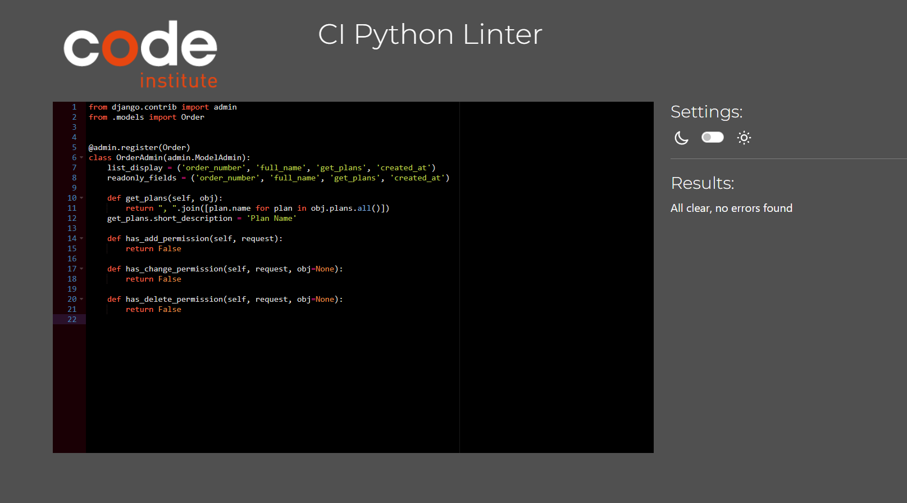
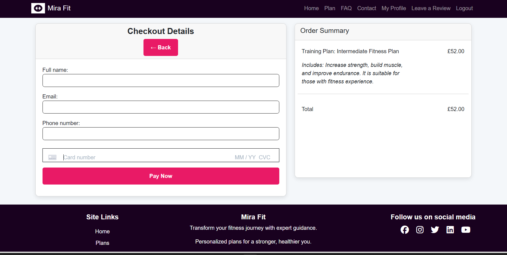

# Testing

> [!NOTE]  
> Return back to the [README.md](README.md) file.

## Code Validation

### HTML

I have used the recommended [HTML W3C Validator](https://validator.w3.org) to validate all of my HTML files.

| Directory | File | Screenshot | Notes |
| --- | --- | --- | --- |
| profiles | profiles.html |  | Pass: No Errors |
| accounts | signup.html |  | I am aware of this error from the validator and is happening due to allauth. I have attempted to remove the `aria-describedby` in the signup form however I was unable to fix it for that reason error will still show up in the validator. |
| checkout | checkout.html |  | Pass: No Errors |
| contact | contact_form.html |  | Pass: No Errors |
| faq | faq.html |  | Pass: No Errors |
| home | home.html |  | Pass: No Errors |
| plans | plans.html |  | Pass: No Errors |
|accounts | login.html |  | Pass: No Errors |
| home | review.html |  | Pass: No Errors |

### CSS

I have used the recommended [CSS Jigsaw Validator](https://jigsaw.w3.org/css-validator) to validate all of my CSS files.

| Directory | File | Screenshot | Notes |
| --- | --- | --- | --- |
| checkout | checkout.css |  | Pass: No Errors |
| profiles | profiles.css |  | Pass: No Errors |
| static | style.css |  | Pass: No Errors |

### JavaScript

I have used the recommended [JShint Validator](https://jshint.com) to validate all of my JS files.

| Directory | File | Screenshot | Notes |
| --- | --- | --- | --- |

| checkout/js | stripe_elements.js |  | Pass: No Errors |

### Python

I have used the recommended [PEP8 CI Python Linter](https://pep8ci.herokuapp.com) to validate all of my Python files.

| Directory | File | Screenshot | Notes |
| --- | --- | --- | --- |
| profiles | urls.py |  | Pass: No Errors |
| profiles | views.py |  | Pass: No Errors |
| profiles | admin.py |  | Pass: No Errors |
| profiles | signal.py |  | Pass: No Errors |
| profiles | models.py |  | Pass: No Errors |
| profiles | forms.py |   | Pass: No Errors |
| home | urls.py |  | Pass: No Errors |
| home | views.py |  | Pass: No Errors |
| home | admin.py |  | Pass: No Errors |
| home | context_processors.py |  | Pass: No Errors |
| home | models.py |  | Pass: No Errors |
| home | forms.py |   | Pass: No Errors |
| checkout | forms.py |  | Pass: No Errors |
| checkout | models.py |  | Pass: No Errors |
| checkout | forms.py |  | Pass: No Errors |
| checkout | models.py |  | Pass: No Errors |
| checkout | urls.py |  | Pass: No Errors |
| checkout | views.py |  | Pass: No Errors |
| checkout | admin.py |  | Pass: No Errors |
| contact | forms.py |  | Pass: No Errors |
| contact | models.py |  | Pass: No Errors |
| contact | urls.py |  | Pass: No Errors |
| contact | views.py |  | Pass: No Errors |
| contact | admin.py |  | Pass: No Errors |
|  | custom_storages.py |  | Pass: No Errors |
| faq | urls.py |  | Pass: No Errors |
| faq | views.py |  | Pass: No Errors |
| mira_fit | settings.py |  | Pass: No Errors |
| mira_fit | urls.py |  | Pass: No Errors |
| mira_fit | views.py |  | Pass: No Errors |
|  | manage.py |  | Pass: No Errors |
| plan | admin.py  |  | Pass: No Errors |
| plans | models.py |  | Pass: No Errors |
| plans | urls.py |  | Pass: No Errors |
| plans | views.py |  | Pass: No Errors |

## Browser Compatibility

I've tested my deployed project on multiple browsers to check for compatibility issues.

| Browser | Home | Plans | FAQ | Profile | Edit Profile | Logout | Login | Register | Checkout | Checkout Success | 404 Page | Notes |
| --- | --- | --- | --- | --- | --- | --- | --- | --- | --- | --- | --- | --- |
| Chrome |  |  |  |  |  |  |  |  |  |  |  | Works as expected |
| Edge |  |  |  |  |  |  |  |  |  |  |  | Works as expected |

